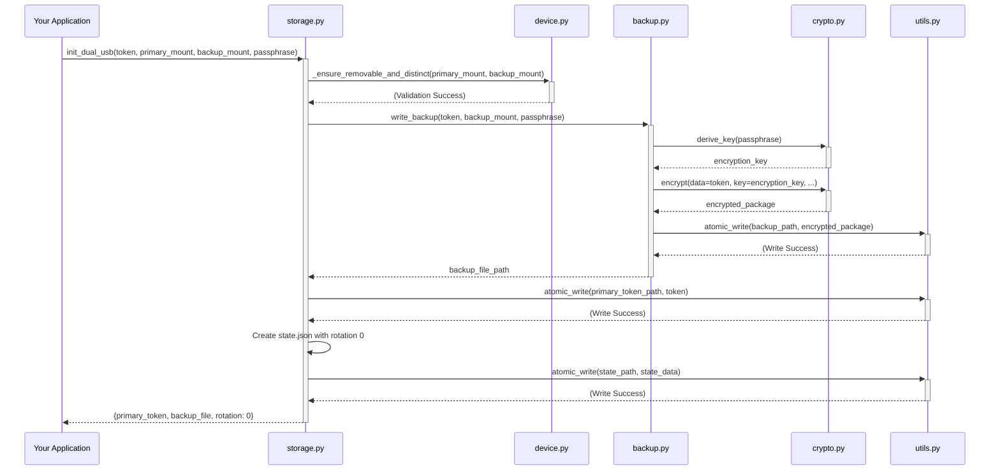
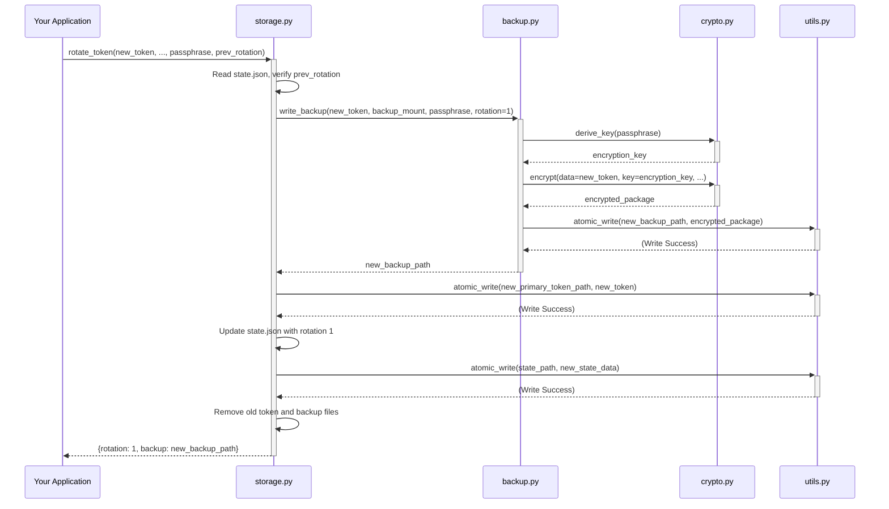
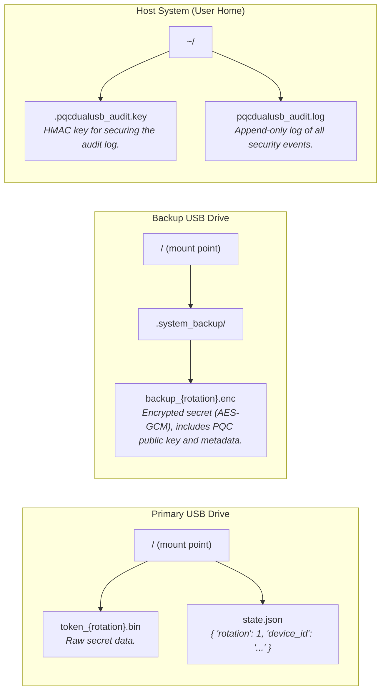
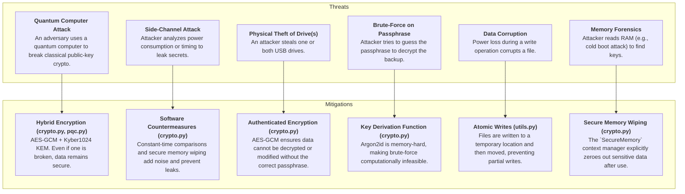

# PQC Dual USB Library - Comprehensive Architecture

This document provides a detailed overview of the architectural design of the **PQC Dual USB Library**. It is intended for developers contributing to the library or anyone interested in its internal workings, security model, and data flows.

## 1. High-Level System Architecture

The system is designed as a Python library that provides a secure, functional API to an application. It manages interactions between the host system and two physical USB drives (Primary and Backup) to store a sensitive token, ensuring redundancy and security through a split-trust model.

```mermaid
graph TD
    subgraph "Host System"
        App[Your Application] --> Lib_API{Public API Functions<br>(storage.py, backup.py)}
        
        subgraph "PQC Dual USB Library (pqcdualusb)"
            Lib_API --> Core_Modules[Core Modules<br>(crypto, pqc, device, audit)]
            Core_Modules --> Backends[Cryptographic Backends<br>(cryptography, argon2, oqs, rust_pqc)]
        end

        Lib_API --> FS_Primary[Primary USB Drive]
        Lib_API --> FS_Backup[Backup USB Drive]
    end

    subgraph "Physical Devices"
        FS_Primary -- "Stores<br>token_{rot}.bin<br>state.json" --> USB1((USB 1))
        FS_Backup -- "Stores<br>.system_backup/backup_{rot}.enc" --> USB2((USB 2))
    end

    style App fill:#cde4ff
    style Lib_API fill:#e6ffc2
    style Core_Modules fill:#fff2c2
    style Backends fill:#ffdac2
```

---

## 2. Detailed Component (Module) Architecture

The library is broken down into several focused modules. This promotes separation of concerns, making the system easier to maintain, test, and audit.

```mermaid
graph TD
    subgraph "Public API"
        storage["storage.py<br><i>Orchestrates all high-level operations</i>"]
        backup["backup.py<br><i>Handles backup creation and restoration</i>"]
    end

    subgraph "Internal Core Modules"
        crypto["crypto.py<br><i>Classical crypto (AES-GCM), KDF (Argon2), secure memory</i>"]
        pqc["pqc.py<br><i>Post-quantum crypto (Kyber, Dilithium), backend selection</i>"]
        device["device.py<br><i>Validates device paths and properties (removable, distinct)</i>"]
        audit["audit.py<br><i>Secure, tamper-evident logging</i>"]
        exceptions["exceptions.py<br><i>Custom exception types</i>"]
        utils["utils.py<br><i>Atomic writes and other helpers</i>"]
    end

    subgraph "External Dependencies"
        dep_crypto[cryptography]
        dep_argon[argon2-cffi]
        dep_oqs[python-oqs]
        dep_rust[Rust PQC Backend (.so/.pyd)]
        dep_psutil[psutil]
    end

    storage --> backup
    storage --> crypto
    storage --> pqc
    storage --> device
    storage --> audit
    storage --> utils

    backup --> crypto
    backup --> pqc
    backup --> audit
    backup --> utils

    crypto --> dep_crypto
    crypto --> dep_argon

    pqc -- "Prefers" --> dep_rust
    pqc -- "Falls back to" --> dep_oqs

    device --> dep_psutil
```

---

## 3. Data Flow Sequence Diagrams

### 3.1. `init_dual_usb` Data Flow

This diagram shows the sequence of events when initializing the dual USB setup for the first time.



### 3.2. `rotate_token` Data Flow

This diagram illustrates the process of updating the secret token, which involves creating a new backup and then updating the primary drive.



---

## 4. Cryptographic Pipeline

The library uses a hybrid cryptographic model, combining classical authenticated encryption (AES-GCM) with post-quantum key encapsulation (Kyber) to derive the final encryption key.

```mermaid
graph TD
    subgraph "Inputs"
        A[User Passphrase]
        B[Per-backup Salt]
        C[Plaintext Secret]
    end

    subgraph "Key Derivation & Encapsulation"
        A -- Argon2id --> D{Derived Classical Key (DCK)}
        
        subgraph "PQC Module"
            E[PQC KEM Keypair Generation] --> F{Kyber Public Key (K_pub)}
            E --> G{Kyber Secret Key (K_sec)}
        end

        F -- Kyber KEM Encapsulate --> H{Ciphertext (CT)}
        F -- Kyber KEM Encapsulate --> I{Shared Secret 1 (SS1)}
    end

    subgraph "Hybrid Key Generation"
        D & I -- "SHA-256 KDF" --> J{Final Encryption Key (FEK)}
    end

    subgraph "Encryption & Packaging"
        C & J -- "AES-256-GCM Encrypt" --> K{Encrypted Data}
        
        F & H & K --> L((Encrypted Backup File<br><i>Contains: K_pub, CT, Encrypted Data, Salt, Nonce, Tag</i>))
    end

    G -- "Stored by user/app<br>Needed for decryption" --> M((Decryption Process))

    style L fill:#d4edda
```

---

## 5. File System Layout

The library creates a specific file and directory structure on the primary and backup USB drives to maintain state and store cryptographic materials securely.



---

## 6. Security Threat Model & Mitigations

The security of the library is built on a defense-in-depth strategy, mapping specific threats to concrete mitigation techniques implemented in the code.


