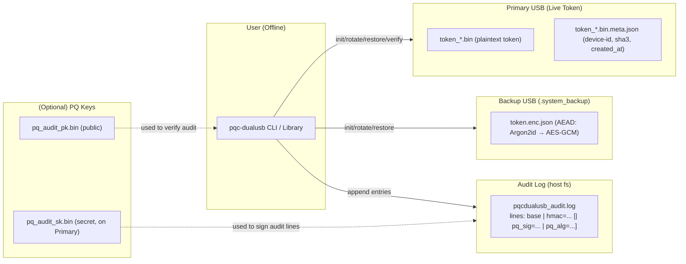
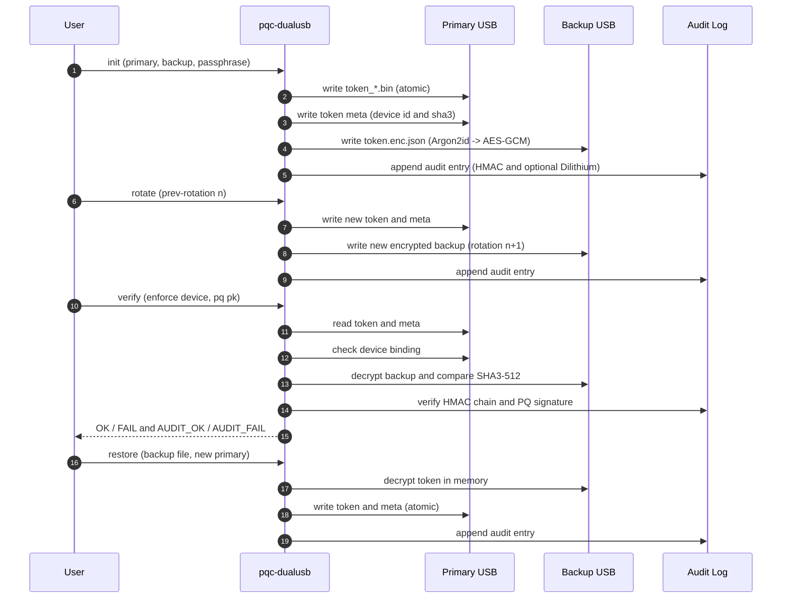
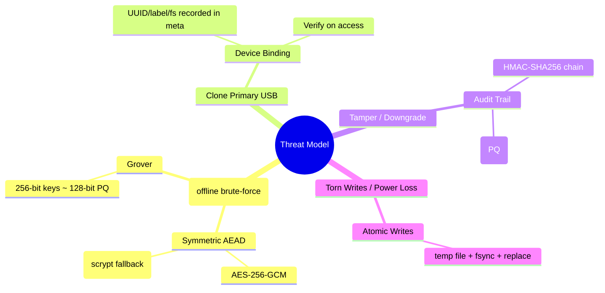

# PostQuantum-DualUSB-Token-Library

`pqcdualusb` — a **Post-Quantum Dual USB Token & Encrypted Backup Library**  
_Offline-ready • Dual-USB enforced • Post-Quantum audit integrity_

[](LICENSE)

---

## 🔑 What is PostQuantum-DualUSB-Token-Library?

`pqcdualusb` is a Python library and CLI for **high-assurance offline secret storage** using **two USB devices**:

- **Primary USB** → stores the live authentication token.  
- **Backup USB(s)** → store AEAD-encrypted backups of the token.  
- **Audit log** → every action (init, rotate, restore) is recorded in an HMAC + PQC (Dilithium) signed log.  

This ensures:
- One USB alone is never enough to compromise your secrets.  
- Backups are **encrypted with Argon2id → AES-256-GCM** (scrypt fallback).  
- Audit logs are **tamper-evident and post-quantum secure**.  

Perfect for offline password managers (like QuantumVault), HSM-like workflows, or air-gapped key custody.

---

## ✨ Features

- 🔒 **Dual USB storage** – enforce token split across two devices.  
- 🛡 **AEAD encrypted backups** – Argon2id → AES-256-GCM with authenticated metadata.  
- 📜 **Audit log** – every action logged with:
  - HMAC-SHA256 (symmetric, Grover-resistant)  
  - Dilithium signature (post-quantum authenticity; auto-enabled if keys exist)  
- 🔑 **Device binding** – backup/primary are tied to device identity to detect cloning.  
- 🔄 **Token rotation** – monotonic counter with rollback/tamper detection.  
- 💾 **Atomic writes** – crash-safe temp file + fsync + replace.  
- ⚡ **Cross-platform** – Linux, macOS, Windows.  
- 🧪 **Batteries included** – unit tests built into the module.  

---

## 📦 Installation

### From PyPI (planned)
```bash
pip install pqcdualusb
```

### From source
```bash
git clone https://github.com/john123304/PostQuantum-DualUSB-Token-Library.git
cd PostQuantum-DualUSB-Token-Library
pip install .
```

### Optional PQC support
For Dilithium audit signing:
```bash
pip install python-oqs
```

---

## 🚀 Usage

### CLI

Initialize dual USB setup:
```bash
pqc-dualusb init \
  --primary /media/USB_PRIMARY \
  --backup /media/USB_BACKUP \
  --passphrase "CorrectHorseBatteryStaple1"
```

Verify backup and device binding (and audit log with PQ key):
```bash
pqc-dualusb verify \
  --primary /media/USB_PRIMARY \
  --backup-file /media/USB_BACKUP/.system_backup/token.enc.json \
  --passphrase "CorrectHorseBatteryStaple1" \
  --enforce-device \
  --pq-audit-pk /media/USB_PRIMARY/pq_audit_pk.bin
```

Rotate token:
```bash
pqc-dualusb rotate \
  --primary /media/USB_PRIMARY \
  --backup /media/USB_BACKUP \
  --passphrase "CorrectHorseBatteryStaple1"
```

Restore from backup:
```bash
pqc-dualusb restore \
  --backup-file /media/USB_BACKUP/.system_backup/token.enc.json \
  --restore-primary /media/USB_NEW_PRIMARY \
  --passphrase "CorrectHorseBatteryStaple1"
```

### Python API

```python
from pathlib import Path
from pqcdualusb import init_dual_usb, verify_dual_setup

# secret token bytes
secret = b"supersecret-token"

# initialize
info = init_dualusb(secret,
                     Path("/media/USB_PRIMARY"),
                     Path("/media/USB_BACKUP"),
                     passphrase="CorrectHorseBatteryStaple1")

# verify
ok = verify_dual_setup(Path(info["primary"]),
                       Path(info["backup"]),
                       passphrase="CorrectHorseBatteryStaple1",
                       enforce_device=True)
print("Verified:", ok)
```

---

## 🗺️ Architecture

### Dual USB + AEAD Backup + Dual-Signed Audit Log


### Init / Rotate / Verify / Restore Flows


### Threats & Defenses


---

## 🔐 Security Notes

- Choose strong passphrases (≥12 chars, uppercase, digit, special).  
- Always eject USBs safely after writes.  
- **Argon2id recommended**; library falls back to scrypt with a warning.  
- Secure deletion is best-effort only (filesystem dependent).  
- PQC features require `python-oqs`. Without it, only HMAC is used.  

---

## 🧪 Development

Run all tests:
```bash
python pqcdualusb.py
```

Lint:
```bash
ruff check .
```

---

## 📜 License

MIT License – see [LICENSE](LICENSE)

---

## 💡 Roadmap

- [ ] PyPI release  
- [ ] Extended PQC key exchange (Kyber) for shared vault recovery  
- [ ] Cross-language verifier for audit logs  
- [ ] Integration with **QuantumVault** password manager  

---

## 🤝 Contributing

PRs welcome! Please open an issue first to discuss major changes. Make sure tests pass and add new tests for features/bugfixes.
