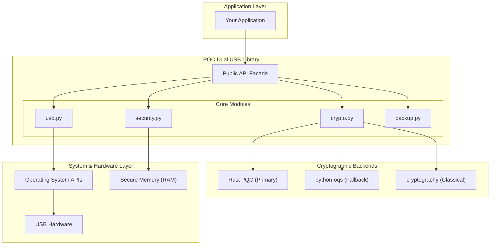
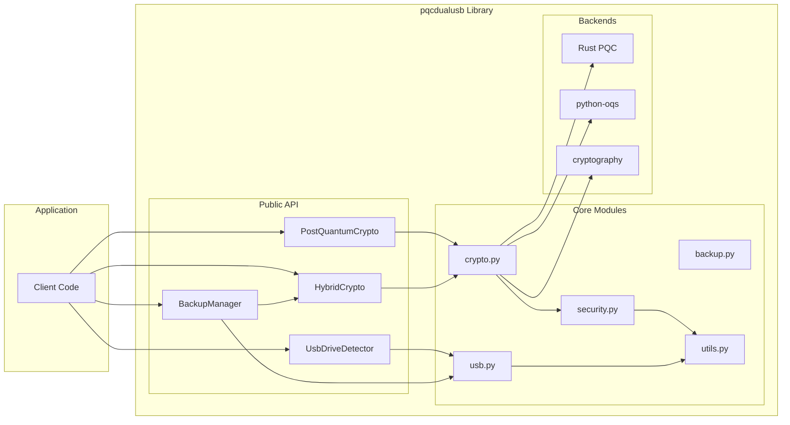
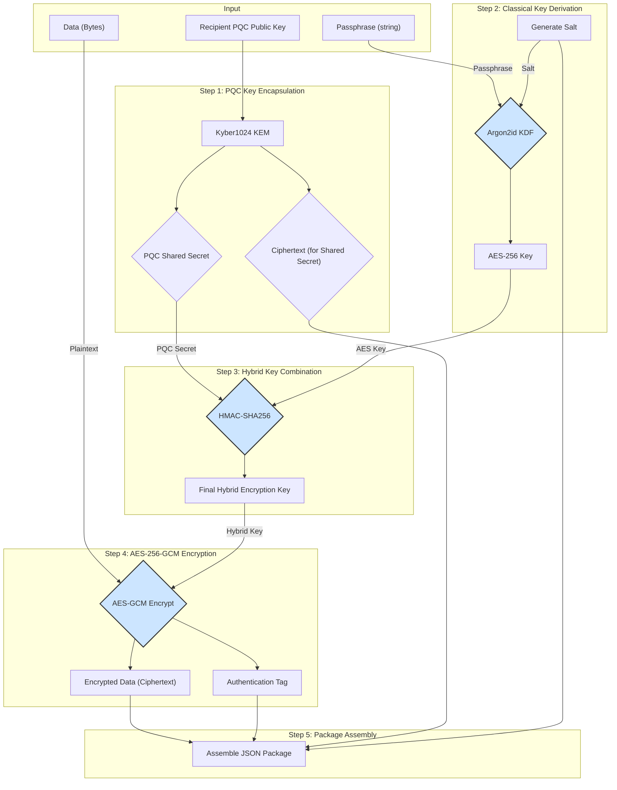
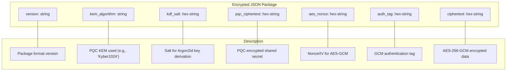
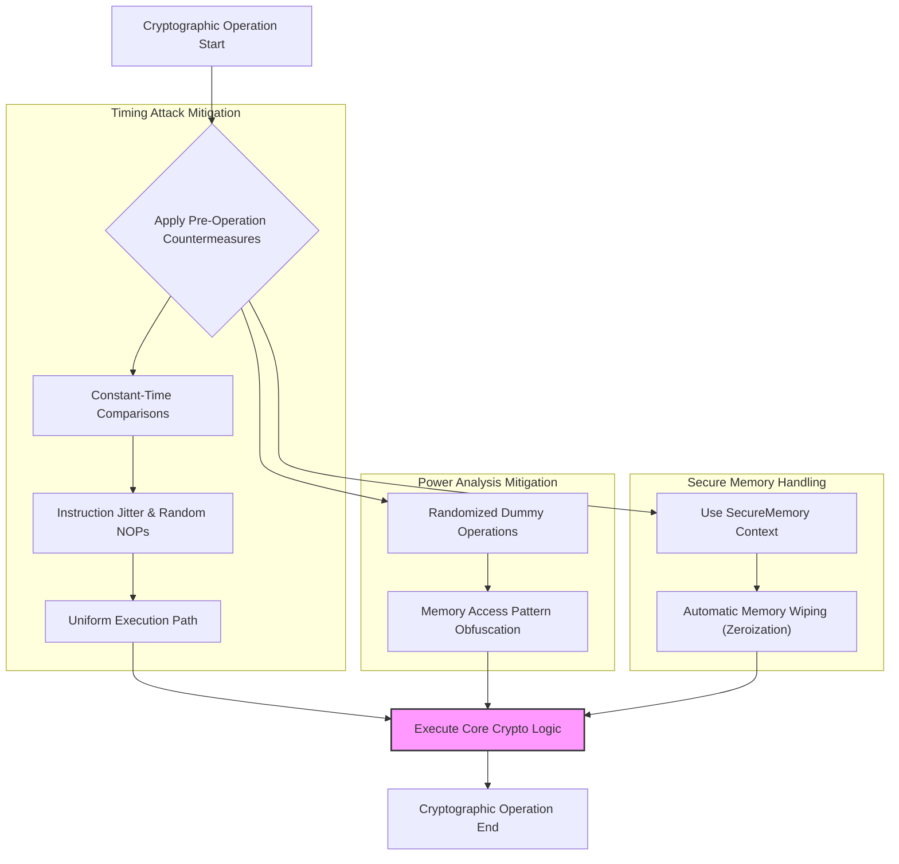
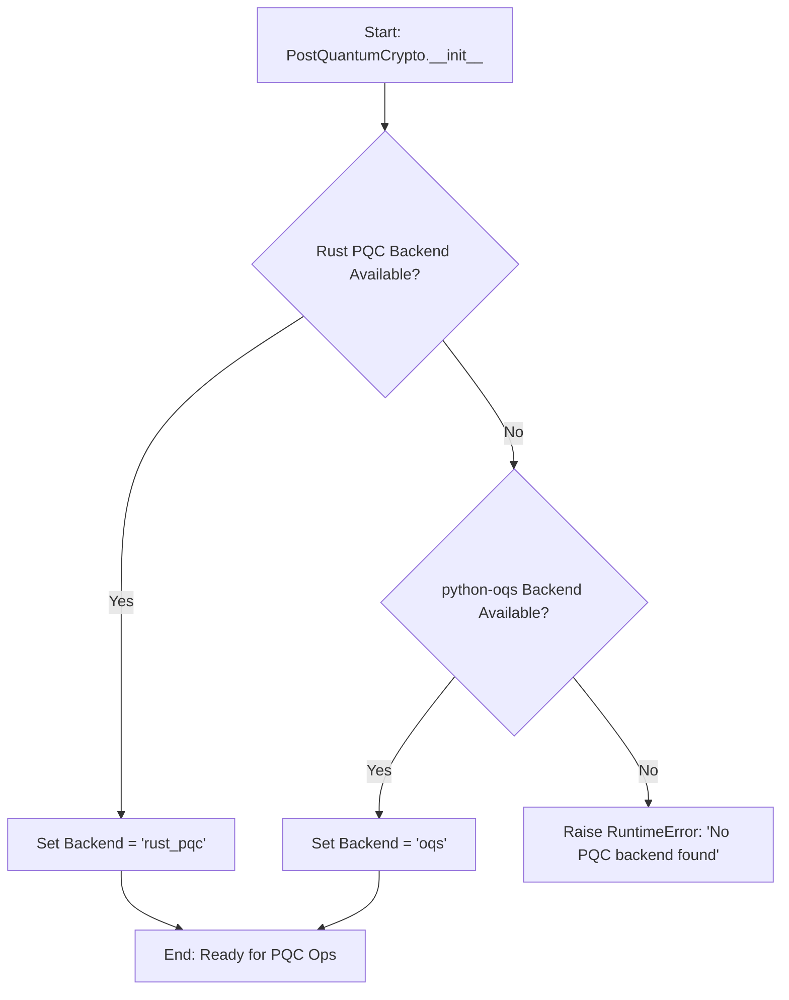
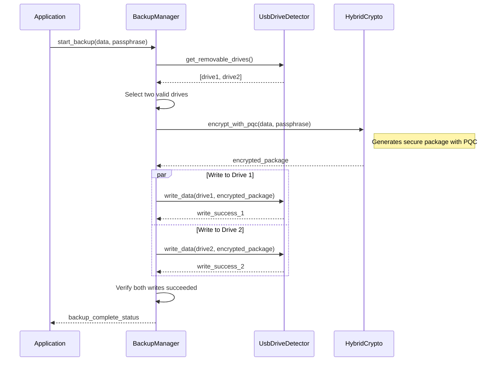
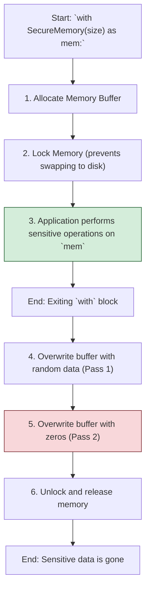

# PQC Dual USB Library

[](https://badge.fury.io/py/pqcdualusb)
[](https://www.python.org/downloads/)
[](https://opensource.org/licenses/MIT)
[](https://en.wikipedia.org/wiki/Post-quantum_cryptography)
[](https://github.com/Johnsonajibi/PostQuantum-DualUSB-Token-Library/stargazers)
[](https://pepy.tech/project/pqcdualusb)
[]()
[]()

A comprehensive **Python library** for post-quantum cryptographic dual USB backup operations with advanced hardware security features and side-channel attack countermeasures.

> **📚 This is a library package** designed to be imported into your applications. See [`USAGE_AS_LIBRARY.md`](USAGE_AS_LIBRARY.md) for integration examples and patterns.

## 📋 Overview

The **PQC Dual USB Library** provides a robust, enterprise-grade solution for securing data against threats from both classical and quantum computers. It offers a high-level API for developers to integrate post-quantum cryptography (PQC) into applications requiring secure data storage, especially for scenarios involving redundant backups on physical devices like USB drives.

The library is designed with a "secure-by-default" philosophy, automatically handling complex security operations like side-channel attack mitigation, secure memory management, and hybrid cryptographic schemes.

### Quick Import Example

```python
from pqcdualusb import PostQuantumCrypto, HybridCrypto, BackupManager

# Initialize quantum-safe crypto
pqc = PostQuantumCrypto(allow_fallback=True)

# Generate quantum-resistant keys
secret_key, public_key = pqc.generate_kem_keypair()

# Encrypt data with hybrid classical+quantum crypto
crypto = HybridCrypto()
encrypted_data, metadata = crypto.encrypt_file(b"sensitive data", "password")
```

## 🏛️ Architectural Vision

The core architecture is designed to be modular, extensible, and secure. It abstracts the complexity of cryptographic backends and hardware interactions, providing a clean and simple API to the application layer.

### High-Level Architecture Diagram

This diagram illustrates the separation of concerns, from the high-level application interface down to the low-level hardware interactions.



### Detailed Component Architecture

This diagram shows the relationships and key responsibilities of each module within the library.



### Hybrid Encryption Data Flow

This diagram details the process flow within the `HybridCrypto.encrypt_with_pqc` method, showing how classical and post-quantum elements are combined to create a secure package.



### Encrypted Package Data Structure

This diagram shows the JSON structure of the final encrypted package, detailing the metadata and cryptographic components.



### Side-Channel Protection Architecture

This diagram illustrates the layers of software-based side-channel protection applied during cryptographic operations.



## ⚙️ Core Workflows & Logic

### PQC Backend Selection Logic

The library prioritizes performance and security by intelligently selecting the best available Post-Quantum Cryptography backend. This flowchart illustrates the decision-making process upon initialization of the `PostQuantumCrypto` class.



### Dual USB Backup Workflow (Conceptual)

This sequence diagram outlines the conceptual workflow for the `BackupManager` to perform a secure, redundant backup to two USB drives.



### Secure Memory Lifecycle

This diagram shows the lifecycle of a `SecureMemory` block, ensuring that sensitive data is automatically cleared after use.



## 🌟 Key Features

### Cryptographic Security
- **Post-Quantum Cryptography**: NIST-standardized Kyber1024 (KEM) and Dilithium3 (signatures).
- **Hybrid Encryption**: Combines classical AES-256-GCM with post-quantum key encapsulation for robust, dual-layer protection.
- **Power Analysis Protection**: Built-in software countermeasures (instruction jitter, random delays) to obfuscate power consumption patterns and mitigate side-channel attacks.
- **Secure Key Derivation**: Uses Argon2id, a memory-hard function, to stretch user passphrases and resist brute-force attacks.

### Hardware & Memory Security
- **Dual USB Backup**: Manages redundant, secure storage across multiple USB devices.
- **Cross-Platform Detection**: Reliably detects removable USB drives on Windows, Linux, and macOS.
- **Secure Memory Management**: Automatically zeroes out memory that held sensitive data (keys, plaintexts) to prevent data leakage.
- **Timing Attack Mitigation**: Employs constant-time comparison operations where possible to prevent attackers from inferring secret data through timing variations.

## 🛡️ Threat Model and Security Guarantees

This library is designed to protect against a range of threats, from common software vulnerabilities to sophisticated nation-state-level attacks.

### Adversary Goals
- **Confidentiality**: Read sensitive data at rest (on USB) or in transit.
- **Integrity**: Modify data without detection.
- **Authentication**: Impersonate a legitimate user or device.

### Attack Vectors Considered
- **Quantum Attacks**: An adversary with a large-scale quantum computer attempting to break public-key cryptography (e.g., using Shor's algorithm).
    - **Mitigation**: **Hybrid Encryption**. The use of Kyber1024 ensures that even if RSA/ECC is broken, the encapsulated key remains secure.
- **Classical Cryptanalysis**: Attacks on AES, Argon2id, or other classical schemes.
    - **Mitigation**: Use of NIST/IETF-standardized algorithms with recommended parameters.
- **Side-Channel Attacks**:
    - **Timing Attacks**: Inferring secret data by measuring execution time.
        - **Mitigation**: Constant-time operations for critical comparisons (`TimingAttackMitigation.compare_digest`).
    - **Power Analysis**: Analyzing power consumption to reveal secret computations.
        - **Mitigation**: Software-based countermeasures like instruction jitter and randomized dummy operations to create noise.
- **Physical Access Attacks**:
    - **Cold Boot Attack**: Recovering data from RAM after a device is shut down.
        - **Mitigation**: **Secure Memory Wiping**. The `SecureMemory` context manager overwrites sensitive data immediately after use.
    - **Device Theft**: Stealing one or both USB drives.
        - **Mitigation**: Strong, multi-layered encryption. Data on the drives is useless without the user's passphrase AND the recipient's PQC secret key.
- **Software Vulnerabilities**:
    - **Buffer Overflows / Memory Errors**: Exploiting memory management bugs.
        - **Mitigation**: Use of Python (a memory-safe language) and a carefully audited Rust backend.
    - **Insecure Key Storage**: Leaking keys from memory.
        - **Mitigation**: `SecureMemory` and immediate clearing of keys from variables when they are no longer needed.

### Security Guarantees
- **Quantum Resistance**: Confidentiality is protected against a future quantum adversary, assuming the security of NIST-selected PQC algorithms.
- **Defense-in-Depth**: An attacker must break both the classical (AES-256) and post-quantum (Kyber) layers to compromise data confidentiality.
- **Forward Secrecy (in context)**: If a long-term PQC secret key is compromised, only data encrypted with that specific key is at risk. Past sessions using different keys remain secure.
- **Side-Channel Resistance**: Provides software-level mitigations that significantly raise the bar for successful side-channel attacks, making them more difficult and expensive to execute.

### Limitations
- **Physical Security**: This library cannot protect against keyloggers, screen-capture malware, or other compromises of the host operating system. The security of the overall system depends on the security of the environment in which it runs.
- **Implementation Bugs**: While audited, the library could still contain unknown implementation flaws. Security is an ongoing process, not a final state.

## 🗺️ Roadmap

This project is under active development. Our goals for the near future include:

### Q4 2025
- **[Feature] Full `BackupManager` Implementation**:
    - Implement the `BackupManager` class to provide a high-level API for orchestrating dual-drive backups.
    - Add features for drive selection, verification, and status reporting.
- **[Security] External Security Audit**:
    - Engage a third-party security firm to perform a full audit of the cryptographic and security-sensitive code.
- **[CI/CD] Automated PyPI Publishing**:
    - Set up GitHub Actions to automatically build and publish new releases to PyPI upon tagging.

### Q1 2026
- **[Feature] Hardware Security Module (HSM) Support**:
    - Add an abstraction layer to support storing PQC keys on HSMs (e.g., YubiKey, NitroKey) via a PKCS#11 interface.
- **[Performance] SIMD-Optimized Backends**:
    - Integrate official PQC implementations that use AVX2/NEON instructions for significant performance gains on supported platforms.
- **[Docs] Expanded Documentation**:
    - Create a dedicated documentation website with detailed API references, tutorials, and security guides.

### Long-Term Vision
- **[Feature] Asymmetric Signatures for Backup Verification**:
    - Integrate Dilithium signatures to sign backup manifests, ensuring the integrity and authenticity of the backup set.
- **[Research] Exploration of New PQC Algorithms**:
    - Monitor the NIST PQC standardization process and evaluate new signature and KEM algorithms as they become available.
- **[Community] Foster a Community**:
    - Encourage contributions, create a public forum for discussion, and build a community of users and developers around quantum-safe software.

## 🏗️ Module Deep Dive

### `crypto.py` - The Cryptographic Heart
- **`PostQuantumCrypto`**: Manages PQC operations. It intelligently selects the best available backend (Rust PQC for performance, `python-oqs` as a fallback).
- **`HybridCrypto`**: Implements a hybrid encryption scheme. It derives a key from a passphrase using Argon2id, combines it with a PQC-generated shared secret, and uses the result to encrypt data with AES-256-GCM. This ensures security even if one of the cryptographic layers is broken.

### `security.py` - The Guardian
- **`SecurityConfig`**: A centralized class defining all security-related parameters (e.g., Argon2id settings, salt sizes).
- **`SecureMemory`**: A context manager that ensures any sensitive data held within its scope is securely wiped from memory upon exit.
- **`TimingAttackMitigation`**: Provides tools to counteract timing side-channels, including constant-time byte comparison.

### `usb.py` - The Hardware Interface
- **`UsbDriveDetector`**: A cross-platform utility to identify removable USB drives, check their properties (free space, mount point), and verify if they are writable. It abstracts away OS-specific commands.

### `backup.py` - The Orchestrator
- **`BackupManager`**: (Future Implementation) Designed to orchestrate the entire dual-backup process, from selecting drives to encrypting and writing data redundantly.

## 📦 Installation

### 1. Standard Installation
```bash
pip install pqcdualusb
```

### 2. Development Installation
For contributing or running tests, clone the repository and install in editable mode with development dependencies.
```bash
git clone https://github.com/Johnsonajibi/PostQuantum-DualUSB-Token-Library.git
cd PostQuantum-DualUSB-Token-Library
python -m venv venv
source venv/bin/activate  # On Windows: venv\Scripts\activate
pip install -e ".[dev]"
```

### 3. Backend Dependencies
The library requires at least one PQC backend. The Rust backend is recommended for performance.

#### Rust PQC Backend (Recommended)
```bash
# Windows
./install_rust_windows.bat

# Linux/macOS
curl --proto '=https' --tlsv1.2 -sSf https://sh.rustup.rs | sh
python build_rust_pqc.py
```

#### OQS Backend (Alternative Fallback)
If the Rust backend is not available, the library will fall back to `python-oqs`.
```bash
pip install python-oqs
```

## 🚀 Quick Start Guide

### Example 1: Hybrid Encryption and Decryption
This example demonstrates the end-to-end process of securing data using the hybrid (classical + post-quantum) system.

```python
from pqcdualusb import PostQuantumCrypto, HybridCrypto

# 1. Initialize the cryptographic components
pqc = PostQuantumCrypto()
hybrid = HybridCrypto()

# 2. Generate a PQC keypair for the recipient
# In a real application, the public key would be shared with the sender.
recipient_public_key, recipient_secret_key = pqc.generate_kem_keypair()

# 3. Data to be encrypted
sensitive_data = b"This data is protected against future quantum attacks."
passphrase = "a-very-strong-and-unique-passphrase"

# 4. Encrypt the data
# This combines the passphrase and the recipient's PQC public key.
encrypted_package = hybrid.encrypt_with_pqc(
    data=sensitive_data,
    passphrase=passphrase,
    kem_public_key=recipient_public_key
)

print("✅ Data encrypted successfully!")
print(f"Ciphertext size: {len(bytes.fromhex(encrypted_package['ciphertext']))} bytes")

# 5. Decrypt the data
# The recipient uses their secret key and the same passphrase.
decrypted_data = hybrid.decrypt_with_pqc(
    package=encrypted_package,
    passphrase=passphrase,
    kem_secret_key=recipient_secret_key
)

assert decrypted_data == sensitive_data
print("✅ Data decrypted successfully!")
print(f"Original Data: {decrypted_data.decode()}")
```

### Example 2: USB Drive Detection
```python
from pqcdualusb import UsbDriveDetector

# Detect all removable drives connected to the system
drives = UsbDriveDetector.get_removable_drives()

if not drives:
    print("No removable USB drives found.")
else:
    print(f"Found {len(drives)} removable drives:")
    for drive in drives:
        try:
            info = UsbDriveDetector.get_drive_info(drive)
            writable = "Writable" if UsbDriveDetector.is_drive_writable(drive) else "Read-only"
            print(
                f"  - Drive: {drive}\n"
                f"    Total: {info['total_space'] // 1024**3} GB\n"
                f"    Free:  {info['free_space'] // 1024**3} GB\n"
                f"    Status: {writable}"
            )
        except (FileNotFoundError, PermissionError) as e:
            print(f"  - Could not access {drive}: {e}")
```

## 🧪 Testing

The library includes a comprehensive test suite to ensure correctness and security.

### Running Tests
```bash
# Install test dependencies
pip install -e ".[dev]"

# Run all tests with verbose output
python -m pytest tests/ -v

# Run tests and generate a coverage report
python -m pytest tests/ --cov=pqcdualusb --cov-report=html
```

## 🤝 Contributing

Contributions are welcome! Please follow the standard fork-and-pull-request workflow.

### Development Setup
1.  Clone the repository.
2.  Create and activate a virtual environment.
3.  Install in development mode: `pip install -e ".[dev,test]"`
4.  Install pre-commit hooks: `pre-commit install`

### Code Style
-   **Formatting**: `black` and `isort`
-   **Linting**: `flake8`
-   **Type Checking**: `mypy`

The pre-commit hooks will automatically enforce the code style.

## 📄 License

This project is licensed under the MIT License. See the [LICENSE](LICENSE) file for details.
