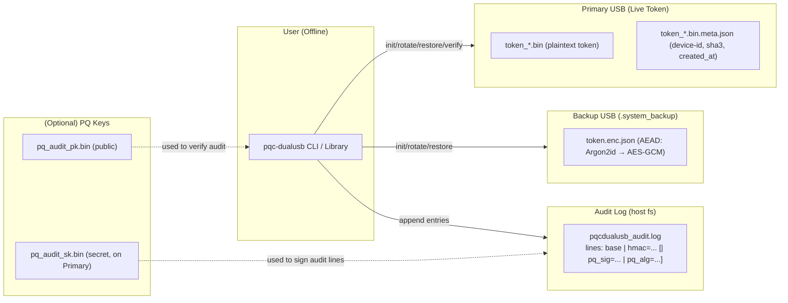
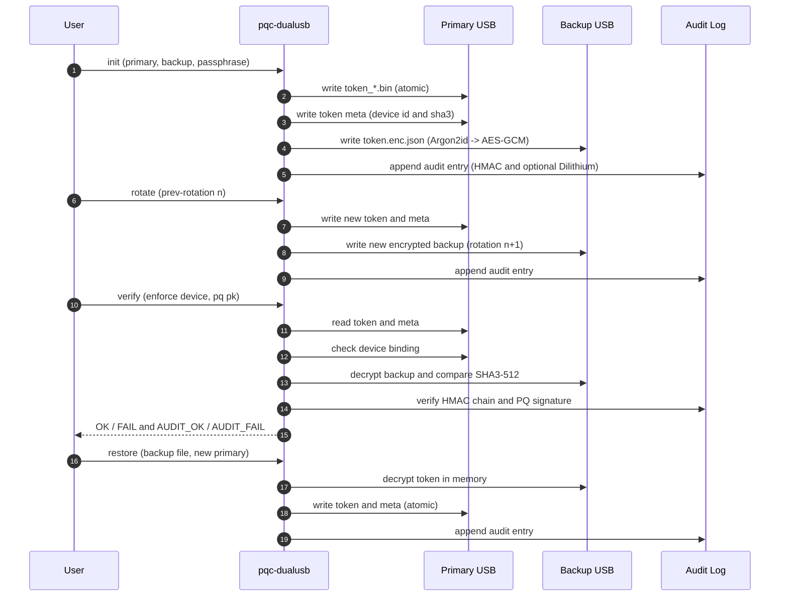
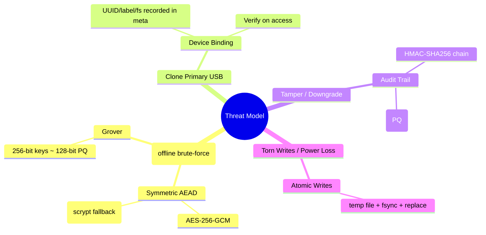

# PostQuantum-DualUSB-Token-Library

A Python library**Core Security**
**Operational**
- Real-time progress reporting with ETA calculations
- Enhanced cross-platform USB detection
- Interactive CLI with smart drive selection
- Atomic writes prevent corruption from crashes
- Configurable security parameters

**Developer Experience**  
- Comprehensive test suite included
- Detailed documentation and examples
- Environment-based configuration
- Robust error recovery mechanismstorage - your token is split across two devices
- AEAD encrypted backups using Argon2id key derivation and AES-256-GCM
- Secure memory management with automatic cleanup
- Timing attack protection for all cryptographic operations
- Comprehensive input validation against common attacksLI tool for secure offline secret storage using dual USB devices with post-quantum cryptography.

[](LICENSE)
[](https://www.python.org/downloads/)

## Overview

This library implements a dual USB security model where secrets are split across two physical devices. No single USB drive contains enough information to compromise your data.

**How it works:**
- **Primary USB**: Stores the live authentication token
- **Backup USB**: Stores encrypted backups of the token  
- **Audit log**: Records every operation with cryptographic signatures

**Security guarantees:**
- Losing one USB drive doesn't compromise your secrets
- Backups use Argon2id key derivation + AES-256-GCM encryption
- All operations are logged with tamper-evident audit trails
- Post-quantum cryptography ready (Dilithium signatures)

**Use cases:**
- Offline password managers (QuantumVault integration planned)
- Air-gapped key custody for cryptocurrency wallets
- HSM-like workflows for enterprise environments

---

## What's New in v0.1.0

We've significantly improved the security and reliability of this library:

**Memory Protection**
- Memory locking prevents secrets from being swapped to disk (Windows VirtualLock, Unix mlock)
- Automatic cleanup ensures sensitive data is wiped from RAM
- Secure buffers protect key derivation operations

**Attack Resistance**  
- Constant-time comparisons prevent timing attacks on authentication
- Random delays make timing analysis much harder
- Input validation blocks path traversal and injection attacks

**Better Operations**
- Real-time progress reporting for long operations
- Automatic log rotation prevents disk space issues  
- Enhanced USB detection works reliably across platforms
- Improved error handling with secure cleanup

All features are production-ready with comprehensive testing.

---

## Features

### Core Security
- 🔒 **Dual USB storage** – enforce token split across two devices.  
- 🛡 **AEAD encrypted backups** – Argon2id → AES-256-GCM with authenticated metadata.  
- � **Secure memory management** – memory locking and automatic sensitive data clearing.
- ⏱️ **Timing attack protection** – constant-time comparisons and random delays.
- 🛡️ **Enhanced input validation** – protection against path traversal and malicious inputs.

**Audit & Integrity**
- Tamper-evident audit logs with HMAC-SHA256 chaining
- Optional post-quantum Dilithium signatures for future-proof security
- Automatic log rotation to prevent disk space issues
- Device binding detects USB cloning attempts
- Token rotation with rollback protection  

### Operational Features
- � **Real-time progress reporting** – ETA calculations and bandwidth monitoring.
- 🖥️ **Enhanced USB detection** – improved cross-platform drive detection and validation.
- 🎯 **Interactive CLI** – smart drive selection and detailed drive information.
- �💾 **Atomic writes** – crash-safe temp file + fsync + replace.  
- ⚡ **Cross-platform** – Linux, macOS, Windows with platform-specific optimizations.

### Developer Experience
- 🧪 **Comprehensive testing** – unit tests and enhancement verification built-in.
- 📚 **Extensive documentation** – detailed inline docs and usage examples.
- ⚙️ **Configurable security** – environment variables for security parameters.
- 🔧 **Error recovery** – robust retry mechanisms and graceful fallbacks.  

---

## Installation

**Requirements:**
- Python 3.8 or higher
- Windows, Linux, or macOS

**Install from source:**
```bash
git clone https://github.com/Johnsonajibi/PostQuantum-DualUSB-Token-Library.git
cd PostQuantum-DualUSB-Token-Library
pip install .
```

**For development:**
```bash
git clone https://github.com/Johnsonajibi/PostQuantum-DualUSB-Token-Library.git
cd PostQuantum-DualUSB-Token-Library
pip install -e .
```

**Test your installation:**
```bash
python dual_usb_backup.py --help
python simple_test.py  # Run security tests
```

**Dependencies:**
- `cryptography` - Core encryption (AES-GCM, key derivation)
- `argon2-cffi` - Better password hashing (recommended)
- `python-oqs` - Post-quantum signatures (optional)

---

## Usage

### Command Line

**See available USB drives:**
```bash
pqcdualusb list-drives --details
```

**Set up dual USB backup:**
```bash
pqcdualusb init \
  --primary /media/USB_PRIMARY \
  --backup /media/USB_BACKUP \
  --passphrase "your-strong-passphrase" \
  --random 64
```

**Verify your setup:**
```bash
pqcdualusb verify \
  --primary /media/USB_PRIMARY \
  --backup-file /media/USB_BACKUP/.system_backup/token.enc.json \
  --passphrase "your-strong-passphrase" \
  --enforce-device
```

**Rotate your token (recommended regularly):**
```bash
pqcdualusb rotate \
  --primary /media/USB_PRIMARY \
  --backup /media/USB_BACKUP \
  --passphrase "your-strong-passphrase" \
  --prev-rotation 0
```

**Restore from backup:**
```bash
pqcdualusb restore \
  --backup-file /media/USB_BACKUP/.system_backup/token.enc.json \
  --restore-primary /media/USB_NEW_PRIMARY \
  --passphrase "your-strong-passphrase"
```

### Python API

```python
import os
from pathlib import Path
from dual_usb_backup import (
    init_dual_usb, 
    verify_dual_setup, 
    UsbDriveDetector,
    ProgressReporter,
    SecureMemory
)

# Find USB drives
drives = UsbDriveDetector.get_removable_drives()
for drive in drives:
    info = UsbDriveDetector.get_drive_info(drive)
    print(f"Drive: {drive}, Available: {info['writable']}")

# Set up dual USB with your secret
secret = os.urandom(64)  # Your secret data

# Initialize with progress tracking
progress = ProgressReporter(description="Setting up dual USB")
info = init_dual_usb(
    secret,
    Path("/media/USB_PRIMARY"),
    Path("/media/USB_BACKUP"),
    passphrase="your-strong-passphrase"
)

# Verify everything works
verified = verify_dual_setup(
    Path(info["primary"]),
    Path(info["backup"]),
    passphrase="your-strong-passphrase",
    enforce_device=True
)
print(f"Setup verified: {verified}")

# Use secure memory for sensitive operations
with SecureMemory(64) as secure_buf:
    secure_buf[:len(secret)] = secret
    # Your secret is protected in memory
    # Automatically cleared when done
```

---

## 🗺️ Architecture

### Dual USB + AEAD Backup + Dual-Signed Audit Log


### Init / Rotate / Verify / Restore Flows


### Threats & Defenses


---

## Security Notes

**Passphrase Requirements**
- Use at least 12 characters (configurable)
- Include a mix of letters, numbers, and symbols
- Consider using a passphrase generator

**Best Practices**
- Always safely eject USB drives after operations
- Store your USB drives in different physical locations
- Regularly rotate your tokens using the `rotate` command
- Keep your audit logs for forensic analysis

**Cryptography**
- Uses Argon2id for key derivation (falls back to scrypt if unavailable)
- AES-256-GCM provides authenticated encryption
- All keys are 256-bit for post-quantum resistance
- Optional Dilithium signatures provide quantum-safe audit logs

**Configuration**
Set security parameters via environment variables:
```bash
export DUAL_USB_ARGON2_M=1048576  # Memory cost (1GB)
export DUAL_USB_ARGON2_T=4        # Time cost 
export DUAL_USB_ARGON2_P=4        # Parallel threads
```  

---

## Development

**Running Tests**
```bash
# Basic functionality
python dual_usb_backup.py

# Security features
python simple_test.py

# Enhancement verification  
python test_enhancements.py
```

**Code Quality**
```bash
ruff check .      # Linting
black .           # Formatting
```

**Contributing**
1. Fork the repository
2. Create a feature branch
3. Add tests for your changes
4. Ensure all tests pass
5. Submit a pull request

Please open an issue before working on major changes.

---

## 📜 License

MIT License – see [LICENSE](LICENSE)

---

## Roadmap

**Recently Completed**
- Memory protection and timing attack resistance
- Progress reporting with ETA calculations  
- Enhanced USB detection across platforms
- Automatic audit log rotation
- Interactive CLI improvements
- Comprehensive input validation
- Secure memory management

**Coming Soon**
- PyPI package release
- Extended post-quantum key exchange (Kyber)
- Cross-language audit log verification  
- QuantumVault password manager integration

**Future Plans**
- Hardware Security Module (HSM) support
- Biometric authentication options
- Enterprise network backup verification
- Formal security verification tools

**Research Ideas**
- Quantum key distribution (QKD) integration
- Side-channel attack analysis
- Homomorphic encryption for secure computation  

## Contributing

We welcome contributions! Please:

1. Open an issue to discuss major changes
2. Fork the repository and create a branch
3. Write tests for new features
4. Ensure all tests pass
5. Submit a pull request

---

## License

This project is licensed under the MIT License - see the [LICENSE](LICENSE) file for details.
